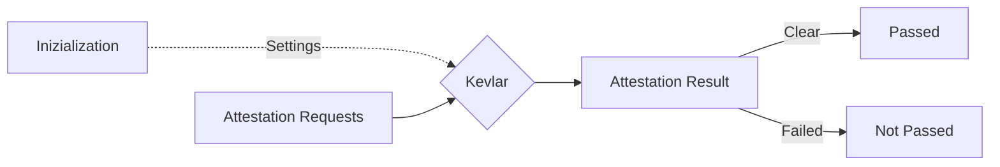

<p align="center">
  <a href="https://github.com/kevlar-kt/kevlar"></a>
</p>

<h1 align="center">Kevlar</h1>

<p align="center">
  <a href="https://github.com/kevlar-kt/kevlar/releases"></a>
  <a href="https://github.com/kevlar-kt/kevlar/actions?query=workflow%3A%22Build%22"></a>
  <a href="https://source.android.com/setup/start/build-numbers"></a>
  <a href="https://kotlinlang.org/docs/releases.html"></a>
  <a href="https://androidweekly.net/issues/issue-528"></a>
  <a href="https://us12.campaign-archive.com/?u=f39692e245b94f7fb693b6d82&id=15eb56d1f5"></a>
  <a href="https://github.com/kevlar-kt/kevlar/blob/master/LICENSE.md"></a>
</p>


## Index
See the [project's website](https://kevlar-kt.github.io/kevlar) for docs and reference.

See the [showcase module](https://github.com/kevlar-kt/kevlar/tree/master/showcase/src/main/kotlin/com/kevlar/showcase) for code samples and library usage.

See the [integration](https://kevlar-kt.github.io/kevlar/pages/overview/dependencies_integration/) page for the dependencies, check a package's implementation page for a comprehensive and specific guide.


## Abstract
Kevlar is a security toolkit (library) for Android apps.
It is divided in 3 packages ([antipiracy], [rooting] and [integrity]), each containing specific tooling and components.

[antipiracy]: https://kevlar-kt.github.io/kevlar/pages/modules/antipiracy/antipiracy/
[rooting]:    https://kevlar-kt.github.io/kevlar/pages/modules/rooting/rooting/
[integrity]:  https://kevlar-kt.github.io/kevlar/pages/modules/integrity/integrity/

Its purpose is to be an auditing tool, used to inspect the security environment on Android devices.

A security environment is the security state of a device, which can be probed with the different packages kevlar provides. 

Each package focuses on a specific security environment area:

- `antipiracy` detects the presence of pirate software installed on the device (user-wise security);
- `rooting` detects the presence of root access, custom binaries, and abnormal OS status (system-wise security);
- `integrity` detects certain types of tampering attempts your app may have been targeted with (app-wise security).

Kevlar is intended to be used any time it is deemed necessary to determine whether the device your app is running on can be regarded as secure, according to your policies and security requirements.


## Security Environment
The security environment is the status of the device.
This is subdivided into **system-wise** security (system modifications, rooting, custom binaries, custom ROMs, emulator, SELinux),
**user-wise** security (pirate stores and pirate apps),
and **app-wise** security (tampering, recompiling, changed signature & metadata)


## Flexibility
Kevlar does not automatically detect a "standard" unsafe environment and give a 0/1 answer.
The kind of environment that is acceptable for your app to run in can be configured in each package individually.

You may be indifferent to some things (e.g. root detection) and very sensitive about others (e.g. app tampering & piracy detection).
You can customize the set of checks the library executes in each package.
Once you define your constraints, kevlar modules will operate accordingly.

If you don't explicitly instruct kevlar to check for a feature, then that feature will not be reported, regardless of its presence (or absence) on the device.


## Design
Each kevlar package contains custom implementations for what it has to scan for, but they all share the same overall structure, to make it easy to work with. Once you learn how to use a package, then you can transfer that knowledge to the other ones.




The founding idea is a flow of attestations. You initialize the package passing to it your settings (what you want to check for). Then you can go ahead and start requesting attestations. An attestation can either be Clear (passed) or Failed (non passed), according to your detection settings.

There may be one or more types of attestation you can request, and you can choose what you want by requesting different ones, to enforce granular control and run efficiently.

Under the hood, each package will call its implementations and run those checks against the operating system/current app, but you'll eventually get an `Attestation` back, so your only job is to check whether it is clear or not.

This makes security declarative: you express your constraints and requirements once while configuring kevlar, which will then take care of - when asked -  producing a report (attestation) for your specific configuration, telling you what was found. And finally you can analyze this report and act accordingly, repeating the process as many times as needed.

## Use Cases
Common use cases for security environment checks are applications managing sensitive resources, such as in-app purchases and subscriptions, valuable server-side resources or APIs, financial transactions, and anything that has a value that gets managed through your app/client.

Ideally, you should request an attestation whenever your client wants to verify the status of the security environment before proceeding with the high-value action.

Kevlar is a sort of guard statement for those actions, which should decrease the probability of an attacker successfully breaking your application's high-value transaction.


## Accuracy
This tool is meant to be an approximate form of environment analysis and estimation.
It covers a large number of attack vectors and does a good job at it.

This does not mean that it is unbreakable. You can find more details in [philosophy], but essentially
it is a level 0 protection that can be removed by manually reverse engineering your app.

[philosophy]: https://kevlar-kt.github.io/kevlar/pages/overview/philosophy/

This doesn't render it useless, it is very efficient in doing *what it is designed to do*: protecting against automated and unskilled attacks,
which will most certainly be the vast majority of what your app will ever be put through.


## Additions & Alternatives
Kevlar resembles what may look like an in-house protection system. It is open source, flexible and rich of features.

For stricter scenarios where higher fidelity and accuracy are required, you should be using something more specific (and radically different).

- [Play Integrity](https://developer.android.com/google/play/integrity) & <s>[SafetyNet](https://developer.android.com/training/safetynet)</s> from Google;
- [AppCheck](https://firebase.google.com/products/app-check) from Firebase;
- [ProGuard](https://www.guardsquare.com/proguard) and [DexGuard](https://www.guardsquare.com/dexguard) from GuardSquare.


## Dependencies

### Antipiracy 
<a href="https://search.maven.org/artifact/io.github.kevlar-kt/antipiracy"></a>
  

```gradle
dependencies {
    implementation 'com.github.kevlar-kt:antipiracy:1.2.0'
}
```

### Rooting  
<a href="https://search.maven.org/artifact/io.github.kevlar-kt/rooting"></a>

```gradle
dependencies {
    implementation 'com.github.kevlar-kt:rooting:1.2.0'
}
```


### Integrity 
<a href="https://search.maven.org/artifact/io.github.kevlar-kt/integrity"></a>

```gradle
dependencies {
    implementation 'com.github.kevlar-kt:integrity:1.2.0'
}
```


## License
This project is licensed under the Apache License, Version 2.0. Please refer to the `LICENSE.md` file inside the Github repository for the full text.

```
Copyright 2022 Kevlar Contributors
Licensed under the Apache License, Version 2.0 (the "License");
you may not use this file except in compliance with the License.
You may obtain a copy of the License at
   http://www.apache.org/licenses/LICENSE-2.0
Unless required by applicable law or agreed to in writing, software
distributed under the License is distributed on an "AS IS" BASIS,
WITHOUT WARRANTIES OR CONDITIONS OF ANY KIND, either express or implied.
See the License for the specific language governing permissions and
limitations under the License.
```
